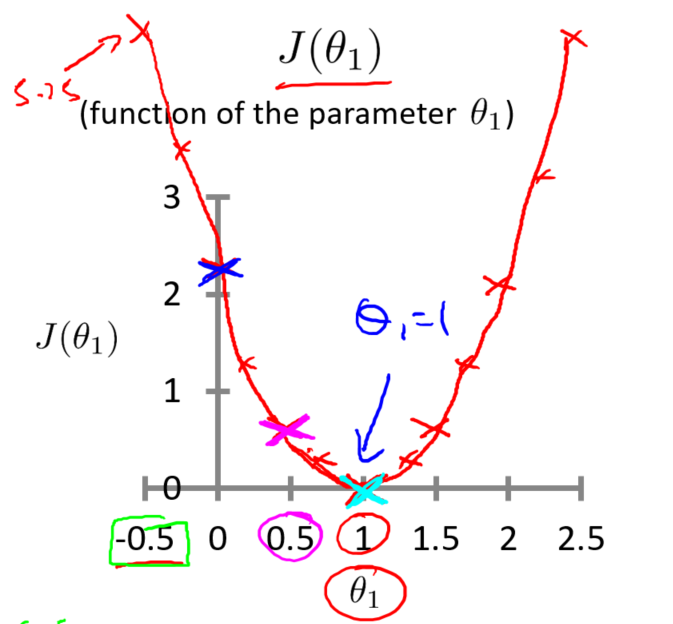

# 代价函数

在数学优化，统计学，计量经济学，决策理论，机器学习和计算神经科学中，代价函数，又叫损失函数或成本函数，它是将一个或多个变量的事件阈值映射到直观地表示与该事件。 一个优化问题试图最小化损失函数。 目标函数是损失函数或其负值，在这种情况下它将被最大。  
上面这段是百度百科对代价函数的定义。 

注：Σ是求和符号，中文读：西格玛


## 如何理解代价函数


```mathjax
$$h_\theta(x)=\theta_1x$$ 
```

我们需求求解最小的θ1，那么求解θ1的公式如下

```mathjax
$$J(\theta_1)=\frac{1}{2m}\sum_{i=1}^{m}(h_\theta(x^{(i)})-y^{(i)})^2$$
```

为了方便理解公式，复制来了一张吴恩达老师视频中的图



```mathjax
$$J(\theta_1)=\theta_1x$$ 
```
```mathjax
$$y=\frac{1}{2m}\sum_{i=1}^{m}(J(\theta_1)^{(i)}-\theta_1^{(i)})^2$$
```